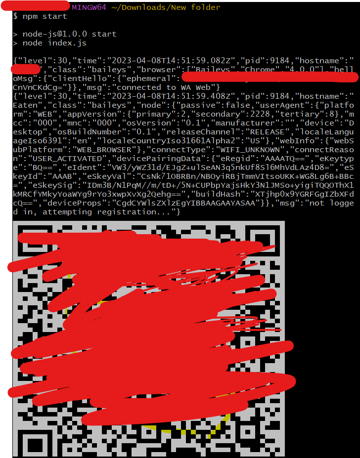

# Bot_WhatsApp-_unclear

|~) _ _ . _  __|_  |/ _  _ _  _  _ _|_ _  _  _ _  _ _   |~  |~) _ _|_  \    /|_  _ _|_ _ /\ |~)|~)  /~_ _ |    . _ | _  _  ~|
|~ | (_)|(/_(_ |   |\(_)| | ||_)(/_ | (/_(_|| (_|| | |  |   |_)(_) |    \/\/ | |(_| | _\/~~\|~ |~   \_/(_||<   |(/_|(_|_\   |
       L|                    |            _|            |_                                                    L|           _|

            ░█████╗░░█████╗░██████╗░░█████╗░  ██╗███╗░░██╗░██████╗████████╗░█████╗░██╗░░░░░██╗░░░░░
            ██╔══██╗██╔══██╗██╔══██╗██╔══██╗  ██║████╗░██║██╔════╝╚══██╔══╝██╔══██╗██║░░░░░██║░░░░░
            ██║░░╚═╝███████║██████╔╝███████║  ██║██╔██╗██║╚█████╗░░░░██║░░░███████║██║░░░░░██║░░░░░
            ██║░░██╗██╔══██║██╔══██╗██╔══██║  ██║██║╚████║░╚═══██╗░░░██║░░░██╔══██║██║░░░░░██║░░░░░
            ╚█████╔╝██║░░██║██║░░██║██║░░██║  ██║██║░╚███║██████╔╝░░░██║░░░██║░░██║███████╗███████╗
            ░╚════╝░╚═╝░░╚═╝╚═╝░░╚═╝╚═╝░░╚═╝  ╚═╝╚═╝░░╚══╝╚═════╝░░░░╚═╝░░░╚═╝░░╚═╝╚══════╝╚══════╝

1. install git bash, kemudian buka gitbash di folder hasil ekstrak (shift + klik kanan mose)
2. Masukkan di git bash ( npm install @adiwajshing/baileys@4.4.0 )
3. kemudian, ( npm install qrcode-terminal@0.12.0 )
4. Langkah terakhir, masukkan command ( npm start )
5. kemudian akan tampil seperti ini ( Tampil Qr-code ) yang harus di scan menggunakan Wa (perangkat tertaut)

6. untuk keluar ( tekan ctrl + c ), dan memulai ulangi dari cara 1

            ▀▀ ▀▀ ▀▀   █▀ █▀▀ ▀█▀ █▀▀ █░░ ▄▀█ █░█   █▀▀ █▀█ █▄░█ █▄░█ █▀▀ █▀▀ ▀█▀   ▀▀ ▀▀ ▀▀
            ▀▀ ▀▀ ▀▀   ▄█ ██▄ ░█░ ██▄ █▄▄ █▀█ █▀█   █▄▄ █▄█ █░▀█ █░▀█ ██▄ █▄▄ ░█░   ▀▀ ▀▀ ▀▀

7. Masukkan [ Menu ] di Wa kemudian kirim

            🅵🅸🆃🆄🆁 🅱🅾🆃 🆄🅽🅲🅻🅴🅰🆁

                                    ╔═══════════════════╦══╗
                                    ║  [ Who Are You ]  ║  ║
                                    ╠═══════════════════╬══╣
                                    ║ [ current date  ] ║  ║
                                    ╠═══════════════════╬══╣
                                    ║ [  1000 Pong   ]  ║  ║
                                    ╠═══════════════════╬══╣
                                    ║ [ Back & exit  ]  ║  ║
                                    ╚═══════════════════╩══╝

